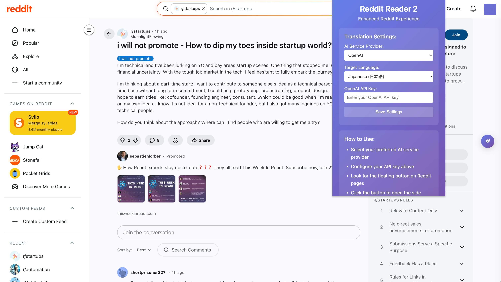
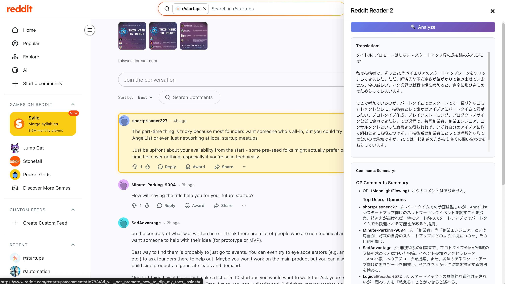
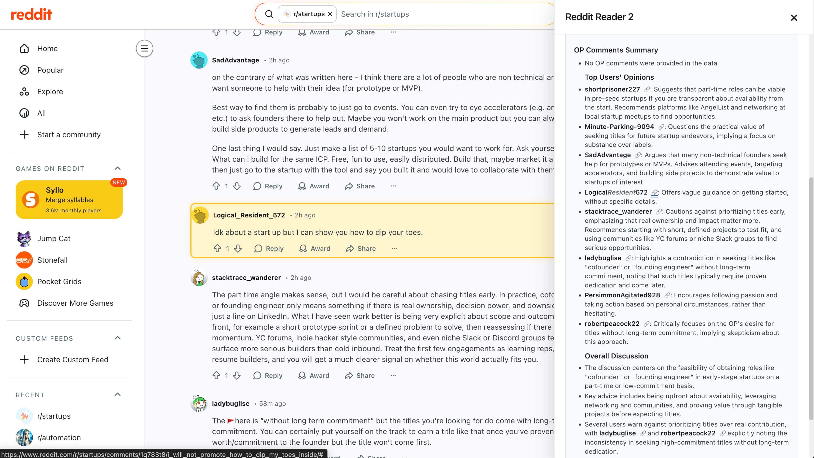

# Reddit Reader 2

A Chrome extension that provides an enhanced Reddit reading experience with a floating panel interface.

## Features

- **Floating Button**: Draggable button that stays visible on all web pages
- **Full-Height Side Panel**: Occupies entire browser window height for maximum content viewing
- **Reddit Content Display**: Automatically extracts and displays Reddit post titles and content
- **AI Translation**: Clean translation interface - translate Reddit posts to Chinese with streaming support using modular AI service architecture
- **Extensible AI Services**: Modular design supports multiple AI providers (currently DashScope, easily extensible to OpenAI, etc.)
- **Smart Page Detection**: Recognizes Reddit post pages and updates content accordingly
- **Auto-Refresh**: Content updates automatically when navigating between pages
- **Responsive Design**: Automatically adjusts to window size changes
- **Smooth Animations**: CSS transitions for panel show/hide and button interactions
- **Modern UI**: Clean, professional design with gradient backgrounds
- **Independent Scrolling**: Panel content area scrolls independently when content exceeds available space
- **Right-Aligned**: Panel aligns perfectly with browser window edge
- **Sharp Design**: Clean edges without rounded corners for a modern look

## Architecture

The extension uses a modular AI service architecture that makes it easy to integrate multiple AI providers:

- **AITranslationService**: Abstract base class defining the translation interface
- **DashScopeService**: Implementation for Alibaba Cloud DashScope API
- **AIServiceFactory**: Factory pattern for creating service instances
- **Extensible Design**: Easy to add new AI providers (OpenAI, Google, etc.)

### File Structure
- `content.js`: Main extension logic and UI
- `ai-services.js`: AI service architecture and implementations
- `content.css`: Styling for the floating panel
- `manifest.json`: Extension configuration

## Installation

1. Clone this repository or download the files
2. Open Chrome and navigate to `chrome://extensions/`
3. Enable "Developer mode" in the top right corner
4. Click "Load unpacked" and select the extension directory
5. The extension will be installed and ready to use

## Usage

1. **Install the Extension**: Load the extension in Chrome Developer Mode
2. **Configure API Key**: Click the extension icon and enter your DashScope API key in the popup
   
   
   *Easy configuration popup to select AI provider and input API keys*

3. **Navigate to Reddit**: Visit any Reddit post page
4. **Use the Floating Button**: Look for the floating button on the page
5. **Open the Panel**: Click the button to open the side panel
6. **Clean Interface**: The panel shows only the translation button (original text is hidden for focused reading)
7. **Translate Content**: Click the "Analyze" button to get AI-powered analyze 

   
   *Floating panel showing AI-translated content and comment analysis (Japanese Target)*

   
   *Example showing English translation and analysis results*

8. **Stream Translation**: Watch the translation appear in real-time with streaming output
9. **Auto-Update**: Content refreshes automatically when you navigate to different posts
10. **Non-Reddit Pages**: On non-Reddit pages, the panel shows a welcome message with usage instructions

## File Structure

```
reddit_reader_2/
├── manifest.json          # Extension configuration
├── content.js             # Main functionality script
├── content.css            # Styling for floating elements
├── popup.html             # Extension popup interface
├── popup.js               # Popup functionality
├── icons/                 # Extension icons
│   └── icon.svg          # SVG icon file
└── README.md              # This file
```

## Development

This extension is built using:
- **Manifest V3**: Latest Chrome extension format
- **Vanilla JavaScript**: No external dependencies
- **Modern CSS**: Flexbox, Grid, CSS Variables, and animations
- **Responsive Design**: Mobile-first approach

## Customization

You can customize the extension by modifying:
- `content.css`: Change colors, sizes, animations
- `content.js`: Add new functionality or modify behavior
- `manifest.json`: Update permissions or add new features

## Browser Compatibility

- Chrome 88+
- Edge 88+
- Other Chromium-based browsers

## License

MIT License - feel free to modify and distribute as needed.

## Future Enhancements

- Reddit content analysis
- Text translation features
- Content summarization
- Custom themes and settings